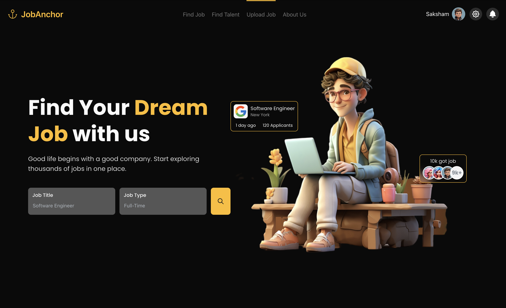

# JobAnchor 🚀 <p align="center">
  
</p>

**A Full Stack Job Portal Application**

JobAnchor is a full-stack job portal designed to connect job seekers and recruiters through a clean, modern interface backed by a robust Spring Boot API and MongoDB data layer. The project is currently under active development.

🔗 **Live Demo:** [jobanchor.vercel.app](https://jobanchor.vercel.app/)

---

## 🛠️ Tech Stack

| Layer | Technology |
|---|---|
| Frontend | React.js, TypeScript, Mantine UI |
| Backend | Spring Boot (REST APIs) |
| Database | MongoDB |
| Routing | React Router |
| Version Control | Git & GitHub |

---

## ✨ Features

- 🎨 Modern, responsive frontend built with React, TypeScript, and Mantine UI
- 🧭 Multi-module navigation for different user roles (job seekers / recruiters)
- 📤 Job upload interface for posting new job listings
- 🔗 REST API integration between frontend and Spring Boot backend *(in progress)*
- 🗄️ MongoDB-backed data storage for jobs and user information *(in progress)*

> **Status:** This project is a work in progress. Backend service integration with the frontend is currently underway.

---

## 📌 Roadmap

- [x] Set up React + TypeScript + Mantine UI frontend
- [x] Implement application routing and navigation
- [ ] Complete Spring Boot REST API endpoints
- [ ] Integrate frontend with backend services
- [ ] Add authentication (job seeker / recruiter roles)
- [ ] Deploy backend and connect to live frontend
- [ ] Add job search & filtering
- [ ] Add application tracking dashboard

---

## 🚀 Getting Started

### Prerequisites
- Node.js (v18+)
- Java 17+ and Maven (for backend)
- MongoDB (local or Atlas)

### Frontend Setup
```bash
git clone https://github.com/<your-username>/jobanchor.git
cd jobanchor/frontend
npm install
npm run dev
```

### Backend Setup
```bash
cd jobanchor/backend
mvn spring-boot:run
```

Update your MongoDB connection string in `application.properties` before running the backend.

---

## 📂 Project Structure

```
jobanchor/      
│   ├── src/      # React + TypeScript + Mantine UI
│   │   ├── components/
│   │   ├── pages/
│   │   └── routes/
│   └── package.json
├── backend/           # Spring Boot REST API
│   ├── src/main/java/
│   └── pom.xml
└── README.md
```

---

## 🙋 Author

**Saksham Verma**
- 📧 sakshamv7070@gmail.com
- 💼 [LinkedIn](www.linkedin.com/in/saksham-verma-678250306)
- 💻 [GitHub](https://github.com/sakshamv7070)

---

## 📄 License

This project is currently for personal/portfolio use. License to be added.
